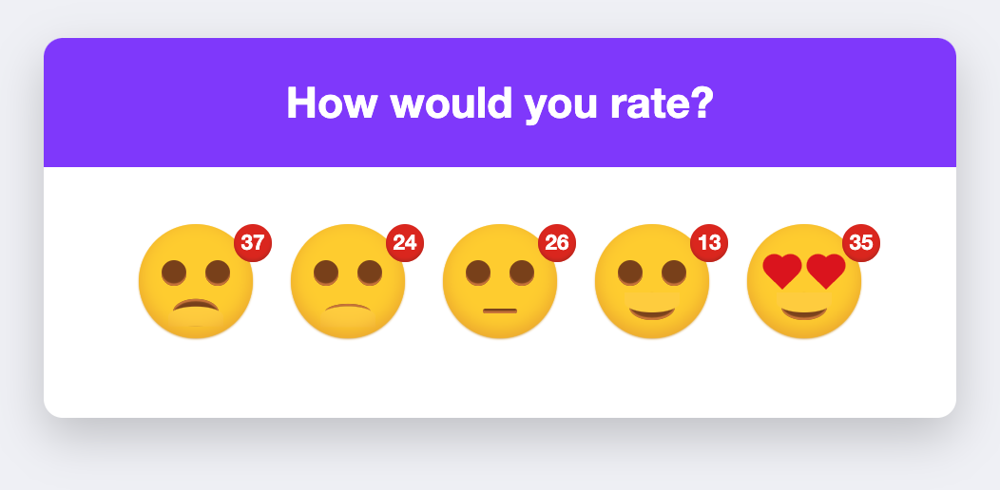

# Feedback Rating System

This project implements a feedback rating system where users can provide ratings and feedback. It includes both frontend and backend components.




## Frontend

The frontend is built using HTML, CSS, and JavaScript. It provides a user interface for users to give feedback ratings. The interface includes animated faces that respond to mouse movements.

### Features

- Animated faces for different feedback ratings.
- Real-time updating of feedback counters.
- Fullscreen mode for better user experience.

### Technologies Used

- HTML, CSS, JavaScript
- jQuery for DOM manipulation
- Firebase for real-time database (Note: This can be replaced with SQLite in the backend)

## Backend

The backend is built using FastAPI, a modern, fast (high-performance), web framework for building APIs with Python 3.7+.

### Features

- API endpoint to post feedback ratings.
- API endpoint to fetch total ratings from the database.

### Technologies Used

- Python
- FastAPI
- SQLite3 database (Note: This is used for storing feedback ratings)

## Installation

1. Clone the repository.
2. Install dependencies using pip:
   
   ```pip install -r requirements.txt```

3. Run the FastAPI server:
   
    ```uvicorn main:app --reload```


## Usage

1. Open the frontend interface in a web browser.
2. Interact with the animated faces to give feedback ratings.
3. The ratings will be stored in the SQLite3 database via the FastAPI backend.

## Sample Image


## Contributing

Contributions are welcome! Feel free to open issues or pull requests.

## License

This project is licensed under the [MIT License](LICENSE).
